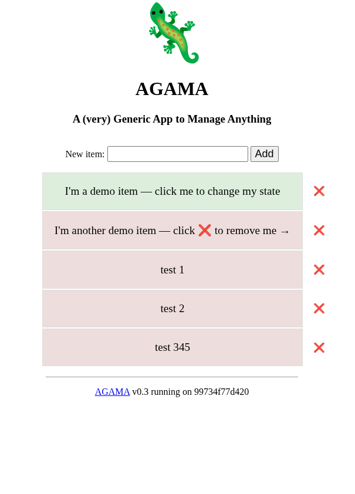
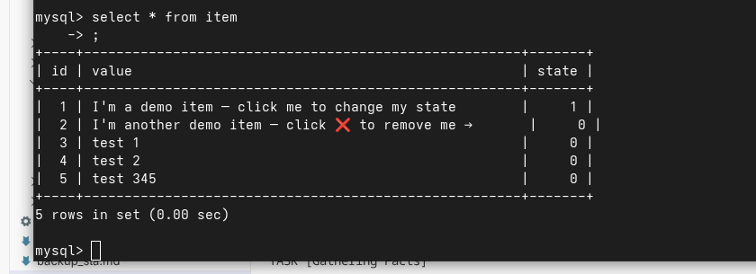
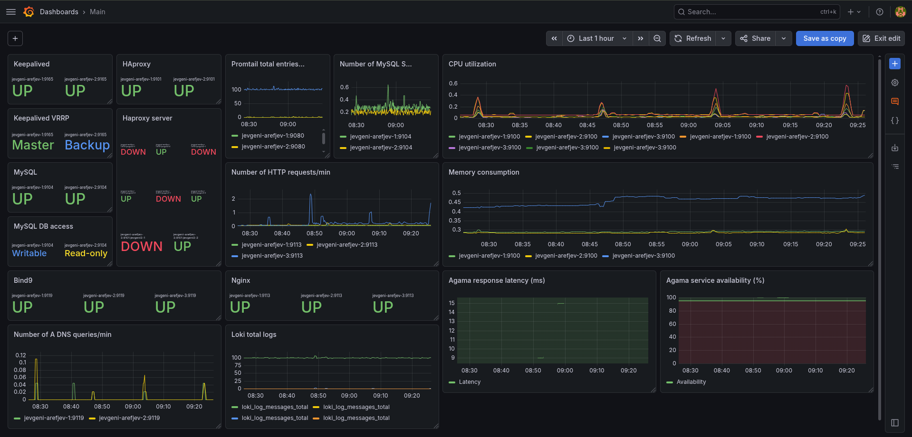

# Highly-Available Web Infrastructure — Ansible

A production-style, fully automated deployment of a highly-available web application across three Ubuntu Linux servers, written in Ansible. **The entire stack is provisioned by a single run of [`infra.yaml`](infra.yaml).** The same command is idempotent (does nothing if everything works) and self-healing (any broken service can be restored by re-running the playbook). Check pre-exam.sh and pre-exam.txt to see tests for idempotence.

```bash
ansible-playbook infra.yaml
```

## Architecture

Three nodes (`jevgeni-arefjev-1/2/3`) running every layer of the stack with redundancy and failover:

| Layer | Service | Nodes | Notes |
|---|---|---|---|
| DNS | **BIND9** | 3 (1 primary + 2 secondary) | Authoritative DNS for `humble.hungry`, dynamic updates via TSIG, upstream forwarding to 1.1.1.1 / 8.8.8.8 |
| Load balancing | **HAProxy** + **Keepalived** | 2 | Active/standby virtual IP (currently `10.0.0.5`, but used to be different for other courses lab setup) for transparent failover |
| Web tier (edge) | **nginx** | 3 | TLS termination and reverse proxy to the app tier |
| Application | **Agama** (Dockerized, multiple containers per host) | 2 | Python web app, run behind nginx, scaled horizontally via `num_agama_containers`. App not written by me. Created by https://github.com/hudolejev for university course |
| Database | **MySQL** with replication | 2 (primary + replica) | Async replication, `read_only` enforced on replicas, dedicated replication / backup / exporter users |
| Backups | **mysqldump** → remote backup server | — | Scheduled cron jobs: DB dumps shipped to an external host over SSH; restore procedure documented for potentially non-technical users in [`backup_restore.md`](backup_restore.md) |
| Metrics | **Prometheus** + **node_exporter** + **mysqld_exporter** | 1 (Prom) / all (exporters) | Scrapes every node and every MySQL instance |
| Dashboards | **Grafana** (Docker) | 1 | Provisioned datasources + dashboards for system, MySQL and app metrics |
| Logs | **Loki** | 1 | Centralized log aggregation, queried from Grafana |
| Container runtime | **Docker** | web_apps + grafana | Used for Agama and Grafana deployments |

## Operational

- **Secrets management** — sensitive values (DB passwords, TSIG keys, replication credentials, exporter creds) are encrypted with **Ansible Vault** directly in [`group_vars/all.yaml`](group_vars/all.yaml).
- **Tagged plays** — every layer (`dns`, `db`, `apps`, `www`, `p`, `g`, `l`, `ha`) can be applied in isolation with `--tags`.
- **High availability** — Virtual IP failover (Keepalived), HAProxy health-checked backends, replicated MySQL, multiple DNS servers, and horizontally-scaled app containers (currently 2 containers on each VM as example).
- **Observability** — full metrics pipeline (Prometheus → Grafana), log pipeline (Loki → Grafana), and exporters on every host and DB.
- **SLO & backup documentation** — see [`slo.md`](slo.md) and [`backup_sla.md`](backup_sla.md).

## Layout

```
infra.yaml           # top-level playbook — runs the whole stack
hosts                # inventory (3 servers, grouped by role)
group_vars/all.yaml  # variables + vaulted secrets
roles/
  init/         bind/        mysql/      docker/
  agama/        nginx/       haproxy/    keepalived/
  prometheus/   grafana/     loki/       uwsgi/
```

## Screenshots

### Web application (Agama, behind nginx + HAProxy VIP)



### MySQL replication / status



### Grafana dashboards (Prometheus + Loki datasources)


